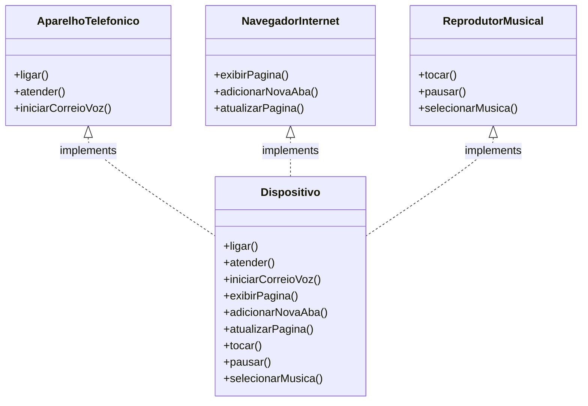

# dio-telefone-exemplo-basico

### Diagrama de Classes

```mermaid
classDiagram
    AparelhoTelefonico <|.. Dispositivo: implements
    NavegadorInternet <|.. Dispositivo: implements
    ReprodutorMusical <|.. Dispositivo: implements

    class AparelhoTelefonico {
        +ligar()
        +atender()
        +iniciarCorreioVoz()
    }

    class NavegadorInternet {
        +exibirPagina()
        +adicionarNovaAba()
        +atualizarPagina()
    }

    class ReprodutorMusical {
        +tocar()
        +pausar()
        +selecionarMusica()
    }

    class Dispositivo {
        +ligar()
        +atender()
        +iniciarCorreioVoz()
        +exibirPagina()
        +adicionarNovaAba()
        +atualizarPagina()
        +tocar()
        +pausar()
        +selecionarMusica()
    }


```
